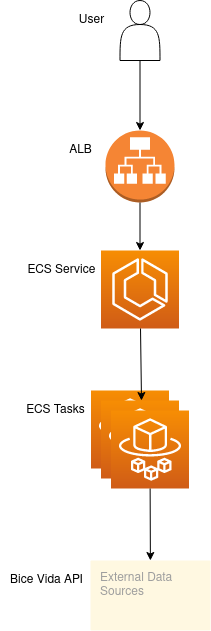

# API
Un unico endpoint disponible el cual consume y expone el endpoint requerido para el challenge.
http://bice-vida-alb-1015104427.us-east-2.elb.amazonaws.com/api

# Stack
+ Go para la API REST
+ Docker
+ AWS ECS como orquestrador de contenedores Docker
+ Terraform para el provisionamiento de infraestructura
+ GitHub Actions para CI/CD

# Arquitectura

# Pipelines
Para este proyecto utilice [GitHub Actions](https://github.com/features/actions) simplemente por desafio personal, ya que nunca lo habia utilizado y ademas de tener beneficios extra como la comodidad en la integracion que tiene con el repositorio y los modulos oficiales para deployar ECS Tasks.

El historial de ejecuciones se puede observar [aqui](https://github.com/bruno-chavez/bice-vida-challenge/actions).

El proyecto cuenta con dos pipeline cuyo codigo se encuentra detallado en `.github/workflows/`: 
+ `ci.yml`: para hacer tareas de CI en paralelo para feedback loops rapidos entre commits de ramas feature.
+ `cicd.yml`: encargado de CI y CD de manera secuencial en master, para asegurar la calidad de codigo y evitar llevar codigo indebido a un ambiente.

## Composicion
Podemos descomponer cada step de CI y CD de la siguiente manera:
### CI
#### Checkout
Step en el cual un git clone de la aplicacion ocurre

#### Build
Step cuyo unico objetivo es asegurarse que la nueva funcionalidad no afecte la compilacion de la aplicacion.

#### Lint
Step en el cual se utiliza [golangci-lint](https://golangci-lint.run/) para encontrar bugs, code smells, etc en el codigo.

#### Test
Step en el cual se ejecutan las pruebas unitarias para asegurarse que la funcionalidad de la aplicacion se mantenga, 
ademas de presentar el porcentaje de codigo cubierto por pruebas unitarias. 

Se utiliza [tparse](https://github.com/mfridman/tparse) para una mejor visualizacion de las pruebas y el coverage en cada paquete.

#### Configure AWS credentials
Step en el cual se condiguran las credenciales para que el pipeline se pueda autenticar con AWS para poder ejecutar los siguientes steps.

#### Login to ECR
Step para autenticarse con ECR para poder subir nuevas imagenes Docker de de la aplicacion,
versionando cada imagen con el commit hash correspondiente.

#### Build, tag, and push Docker image
Step donde se ejecuta el Dockerfile para compilar, tagear y subir la imagen a ECR.

#### Updates task definition
Step en el que se crea una nueva Task Definition a partir de la imagen creada en el paso anterior.

### CD
#### Deploy
Unico step propiamente tal sobre Continuous Delivery, 
en el cual se actualiza el Service con el Task Definition creado en el step anterior.

Se despliega con una estrategia "Rolling Release" lo que significa para nuestro caso concreto que en una ventana de despliegue se desplegaran 2 tasks con la nueva version y una vez que los 4 tasks totales esten funcionando se iran matando tasks de la version anterior.

De esta manera se asegura que solo se desplieguen cambios seguros y sin provocar downtime.

# GitHub Flow
El flujo de Git utilizado es una modificacion de [GitHub Flow](https://guides.github.com/introduction/flow/) donde en vez de depesplegar despues de aprobar un PR, 
se hara cuando el PR se una con master.

La ventaja de esto es que podemos revisar la integracion del PR con lo que hay en master y asegurarse de que sea una union exitosa y solamente despues de esta revision llevar los cambios a algun ambiente.

# IaC
Todo el codigo para el provisionamiento de la infrastructura se encuentra dentro de `iac`, 
el cual esta dividido en `modules` y `workspaces` siendo el primero la carpeta donde se encuentran los modulos y el segundo donde se utilizan estos. 
La ejecucion de los workspaces fue desde mi local con el cli de Terraform.

En un escenario mas realista hubiera tenido cada modulo en su propio repositorio con git tags para el versionamiento de estos y con un pipeline con static checks. 
Mientras que los `workspaces` serian utilizados desde un pipeline de CI/CD, Terraform Cloud o una herramienta de GitOps como Atlantis.
 